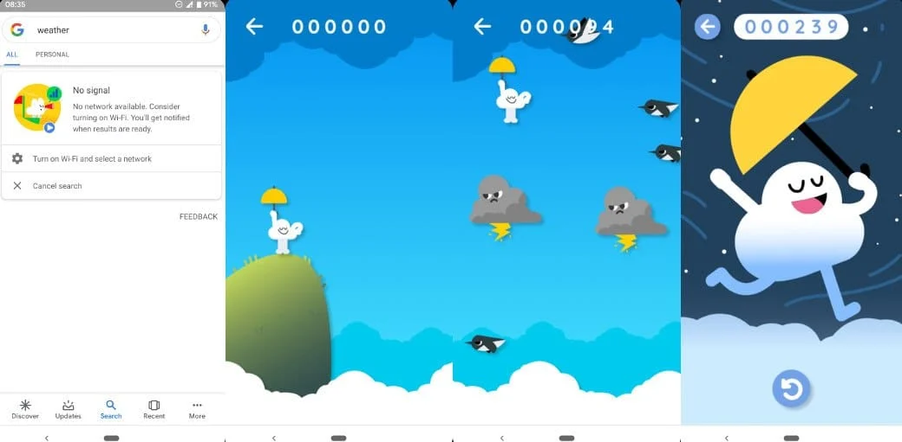
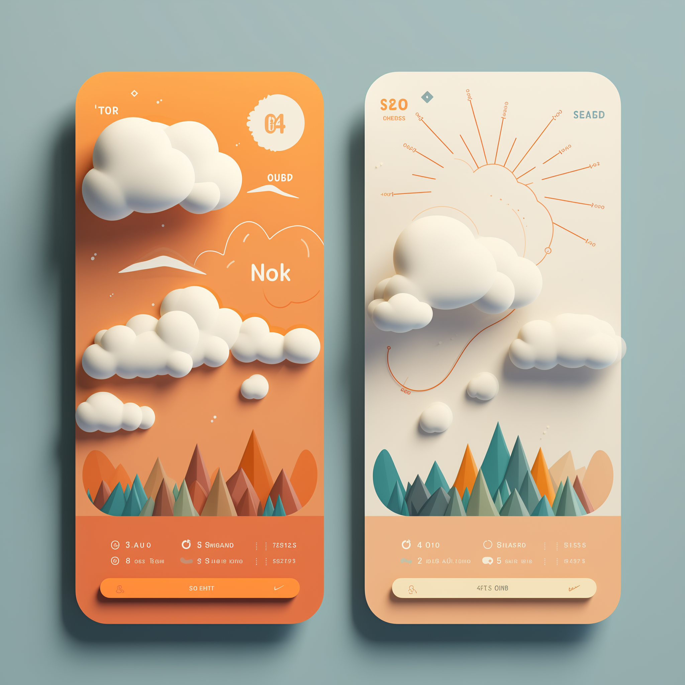

### Team 007

## How to contribute

git pull https://github.com/alekslario/007.git

# checkout your branch

git checkout [your_name]

# if you branch doesn't exist create it with

git branch [your_name]

git checkout [your_name]

# make changes

# then stage changes

git add [list_of_the_files_divided_by_space]

# an alternative syntax that will add changes files

git add .

# commit changes

git commit -m "Changes description here"

# push changes to Github

git push

# Go to Github and create a pull request

# Wait for the review to approve your changes

## Timeline of events

26.12.2023 - In idea

Alex had the idea of integrating gaming elements into the app, reminiscent of Google's Cloud Game. Perhaps that's the differentiator we have been seeking all along.

12.01.2024 - First sprint
We discussed with Sean what we were going to do the following week and agreed that we need to divide the project into small manageable chunks. For the next week, we are going to focus on creating a barebones functional prototype - querying the weather data and displaying the data on the screen of a bootstrapped app.
